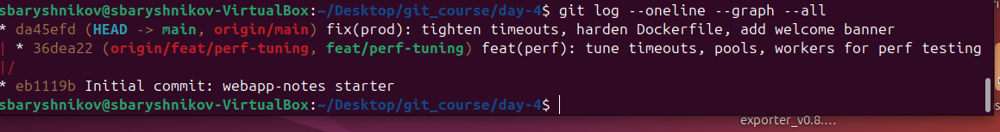
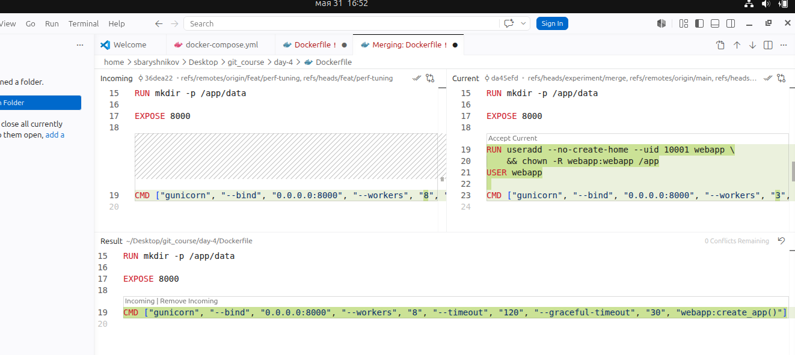
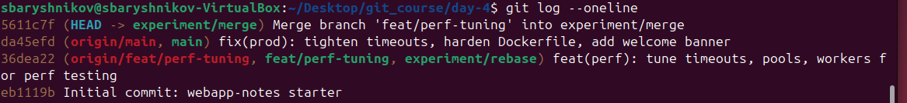
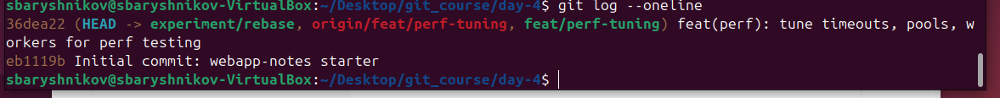
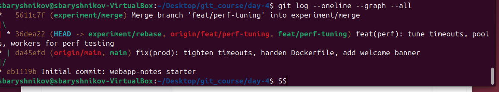
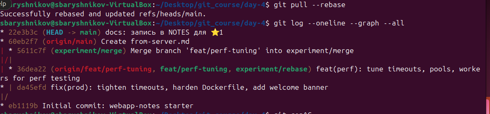
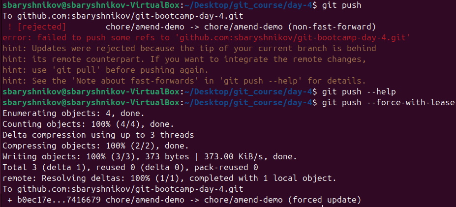
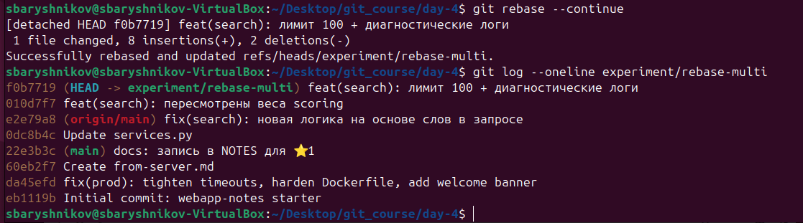
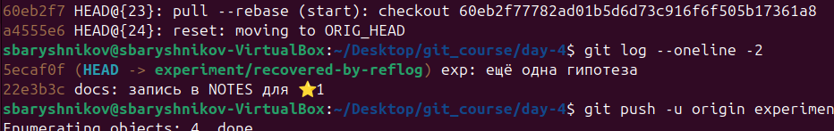

# LAB — день 4


Курс: [«Интенсив по погружению в GIT»](https://slurm.io/git-intensive)


## Базовая задача — `01-merge-vs-rebase`

### Стартовое состояние

Ветка `feat/perf-tuning` была идентична `main`, но потом в каждой из них были изменёны одни и те же файлы:  `webapp/services.py`, `webapp/templates/index.html`, `Dockerfile `, `webapp/config.py`
После этого автоматическое объединение веток стало невозможным.

```bash
# git log --oneline --graph --all (на момент окончания подготовки)
```



### Путь A — через `merge`

На ветке `experiment/merge` запущена команда `git merge feat/perf-tuning`, при этом обнаружены конфликты в четырёх измененных файлах. Файл `Dockerfile` исправлен в VS Code, остальные в редакторе vim.

```bash
# ключевые команды
```





### Путь B — через `rebase`

На ветке `experiment/rebase` запущена команда `git rebase feat/perf-tuning`, при этом обнаружены конфликты в четырёх измененных файлах, которые исправлялись в текстовом редакторе.

```bash
# ключевые команды
```



### Сравнение

Финальная история всех веток рядом:



При сравнении merge vs rebase видно, что:
- merge создаёт дополнительный коммит, в котором применяются недостающие изменения и разрешаются конфликты. При этом в истории видны две ветки их ветвление и слияние.
- rebase переносит текущую ветку в ту, на которую делается ребейз, а коммиты, сделанные в текущей ветке применяются по одному заново. При этом коммиты, которые реально создавались в текущей ветке, пропадают. В итоге история выглядит линейной, есть только названия веток, как указатели на последний коммит в каждой ветке.

### Какой подход я бы выбрал(а) в команде и почему

Для слияния ветки в main буду использовать merge, чтобы можно было отслеживать появление новых фич по мерж-коммитам.
Для обновления рабочей ветки лучше использовать rebase, чтобы не усложнять структуру истории

## Задания со звездочкой (опционально)
> это заполняете только если делали. иначе не включайте в отчет и удалите их шаблона

### ⭐1 — `git pull` vs `git pull --rebase`

`git pull` по умолчанию использует merge, и создаёт новый коммит при обновлении из main ветки. `git pull --rebase` использует rebase, что сохраняет более простой вид истории и не создаёт ненужных коммитов. Имеет смысл добавить в конфиг pull.rebase = true, чтобы такое поведение было дефолтным.



### ⭐2 — `--force-with-lease` vs `--force`

`git commit --amend` переписывает историю, изменяя коммит, поэтому просто запушить такие изменения невозможно. `git push` с опцией `--force-with-lease` безопаснее, чем с опцией `--force`, потому что позволяет убедиться, что кто-то еще не успел обновить эту же ветку.



### ⭐3 — rebase с конфликтом на каждом коммите

При попытке rebase пришлось решать конфликты отдельно для каждого коммита. После каждого исправления продолжение операции rebase запускается с опцией `--continue`. Процедура не очень приятная, потому что сложно исправлять конфликты, не зная, каких коммитов еще не хватает, и не понимая до конца итоговую картину изменений



### ⭐4 — безопасный выход из detached HEAD

Зашел в detached HEAD с помощью команды `git switch --detach` с указанием целевого коммита. Закоммитил новые изменения, сохранил их в новой ветке, созданной с помощью команды `git switch -c experiment/saved-from-detached`. Несохранённые ни в какой ветке изменения можно найти с помощью команды `git reflog`, найти хэш нужного коммита и сохранить его в новой ветке с явным указанием этого коммита `git switch -c experiment/recovered-by-reflog <hash-из-reflog>`.



